**Departamento Académico de Ingeniería C8286-Computación Paralela y Distribuida** 

**Evaluación: Sobre la línea de comandos**

**Nombre:[ Josue Eduardo Huarauya Fabian**](mailto:josue.huarauya@upch.pe)**

**Objetivos**

Linux, siendo un sistema operativo tipo Unix, es ampliamente utilizado en servidores, supercomputadoras y sistemas distribuidos. Conocer la línea de comandos de Linux permite comprender y manipular el sistema operativo subyacente en el que se ejecutan sus aplicaciones concurrentes y distribuidas, ofreciendo una comprensión profunda de su entorno de ejecución.

La línea de comandos de Linux es una herramienta poderosa para la automatización de tareas repetitivas y la gestión eficiente de recursos del sistema. Podemos aprender a escribir scripts para automatizar la compilación y ejecución de sus programas, la gestión de procesos, el monitoreo del uso de recursos y la implementación de sistemas. Esta habilidad es invaluable en entornos de computación distribuida, donde la gestión manual de múltiples nodos y servicios puede ser tediosa y propensa a errores.

Muchas herramientas esenciales para el desarrollo, la prueba y la depuración de software en computación concurrente y distribuida son accesibles a través de la línea de comandos. Esto incluye herramientas para control de versiones (como **git**), empaquetado y despliegue de software (como **make** y **docker**), y monitoreo de rendimiento y recursos (como **top**, **vmstat**, y **netstat**). Familiarizarse con estas herramientas es esencial para el desarrollo de software eficiente.

El conocimiento de la línea de comandos es fundamental para interactuar con servicios en la nube y sistemas distribuidos, muchos de los cuales ofrecen interfaces basadas en CLI (Command Line Interface) para su gestión y configuración. Aprenderemos a desplegar, configurar y monitorear aplicaciones distribuidas en entornos cloud, utilizando la línea de comandos.

La línea de comandos promueve un entendimiento más profundo de cómo funcionan los computadores y las redes, alentando a todos a pensar y resolver problemas de manera algorítmica. Esta forma de pensamiento es transferible a muchos otros ámbitos de la informática y la ingeniería de software.

**Instrucciones de Entrega:**

- Realiza todos los pasos de cada sección en la terminal, capturando capturas de pantalla o copiando el texto de la terminal que demuestre la ejecución de la sección Learning the Shell de la página: <https://linuxcommand.org/lc3_learning_the_shell.php>
- Crea un documento en markdown que incluya una breve explicación de cada tarea, junto con las capturas de pantalla o texto correspondiente.
- Subir el documento final a tu repositorio personal hasta el día 13 de abril (23:59).

Computación Paralela y Distribuida

1. **What is “the shell”?**

Esta captura de pantalla muestra el uso de comandos esenciales de navegación en la terminal de Linux. **“pwd”** (print working directory) se utiliza para mostrar el directorio actual, asegurando que el usuario sepa en qué parte del sistema de archivos se encuentra. **“ls”** lista todos los archivos y directorios en el directorio actual, mientras que **“cd”** (change directory) se utiliza para cambiar al directorio especificado, demostrando cómo moverse eficientemente en la estructura de archivos.

2. **Navigation**

En esta imagen, el comando **“ls -l”** se utiliza para listar todos los archivos y directorios con detalles detallados, incluyendo permisos, número de enlaces, propietario, grupo, tamaño y fecha de última modificación. Esto es crucial para comprender la estructura de archivos y permisos, una habilidad fundamental para la administración de sistemas.

3. **Looking Around**

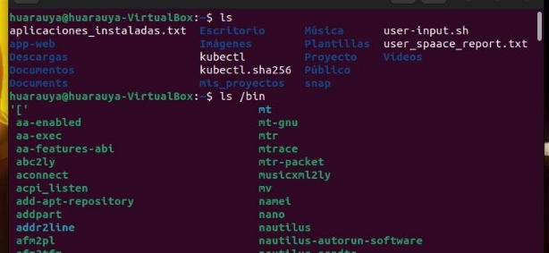

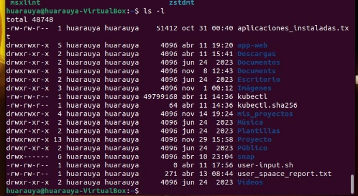

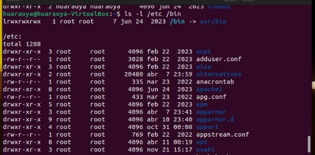

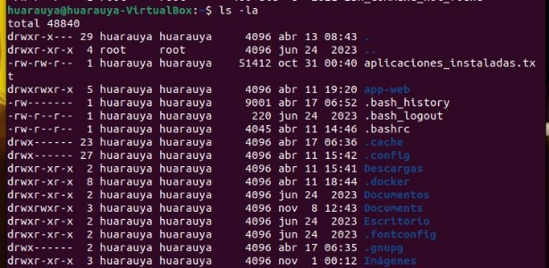

Aquí se demuestra cómo manipular archivos usando **cp** para copiar archivos de un lugar a otro, **mv** para mover archivos (lo cual también sirve para renombrarlos), y **rm** para eliminar archivos. Estos comandos son esenciales para la gestión de archivos y se utilizan frecuentemente para organizar y mantener limpio el espacio de trabajo en la terminal.

4. **A Guided Tour**

Esta captura ilustra la redirección de entrada y salida utilizando los operadores **>** para redirigir la salida de un comando a un archivo, sobrescribiendo el contenido existente, y **>>** para agregar la salida al final de un archivo existente. El operador **<** se usa para redirigir la entrada de un archivo a un comando. Estas técnicas son fundamentales para la creación de scripts y la automatización de tareas.

5. **Manipulating Files**

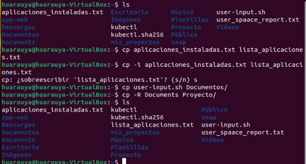

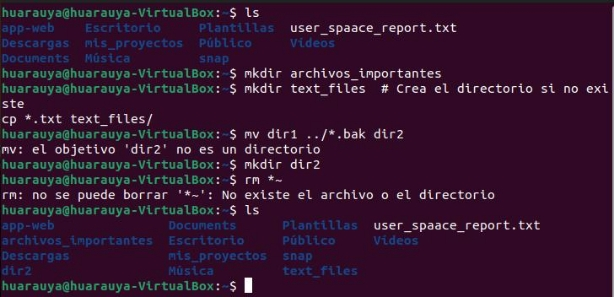

La imagen muestra cómo encadenar comandos mediante tuberías **(|)**, permitiendo que la salida de un comando sirva como entrada al siguiente. Ejemplos incluidos son **grep** para filtrar contenido, **sort** para ordenar datos y **cut** para extraer secciones de cada línea de archivos. Estas herramientas son poderosas para procesar grandes cantidades de datos rápidamente.

6. **Working with commands**

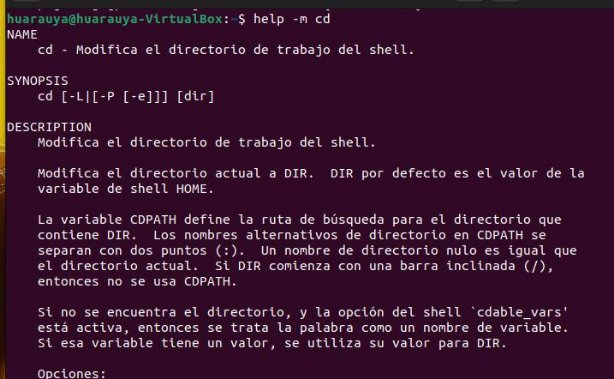

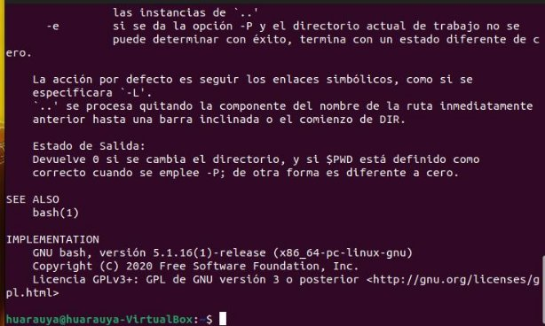

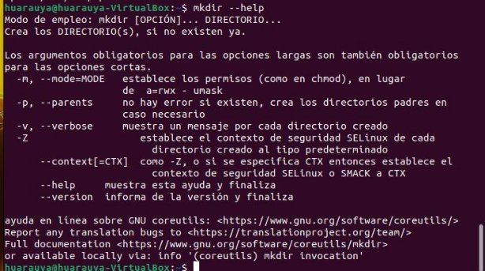

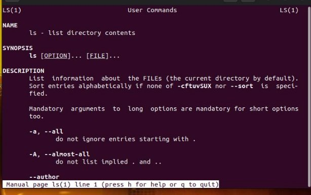

Se utiliza la expansión de nombres de archivos y comodines (**\*** y **?**) para operar con múltiples archivos que cumplen ciertos patrones, facilitando tareas masivas como copias, movimientos o eliminaciones sin necesidad de referenciar cada archivo individualmente.

7. **I/O Redirection**

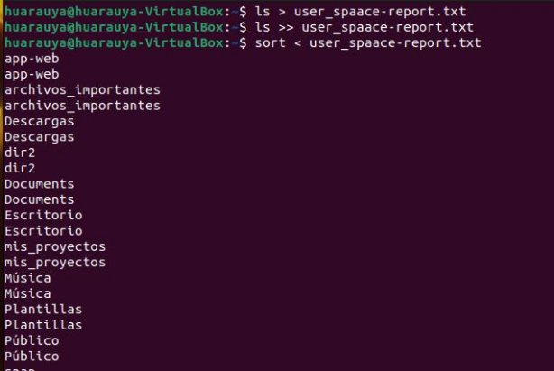

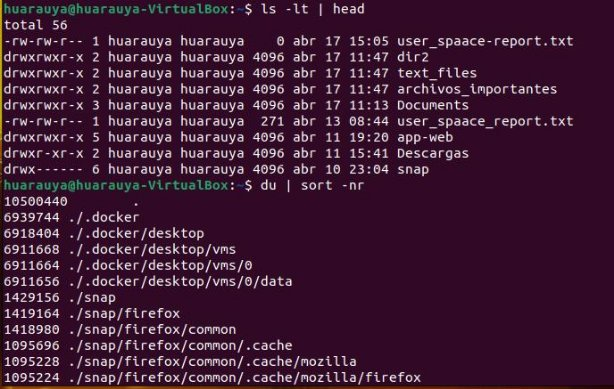

Esta captura enseña el uso de **chmod** para cambiar los permisos de archivos y **chown** para cambiar su propietario y grupo. Estos comandos son cruciales para la seguridad y administración adecuada de los accesos a los archivos en entornos multiusuario.

8. **Expansión**

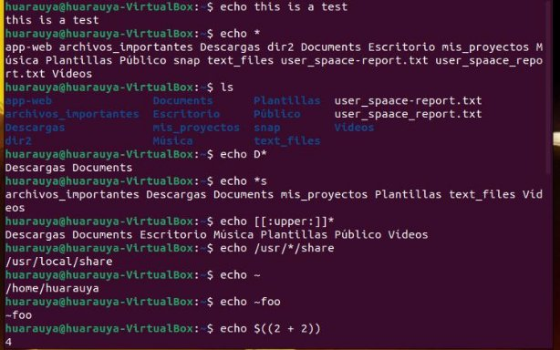

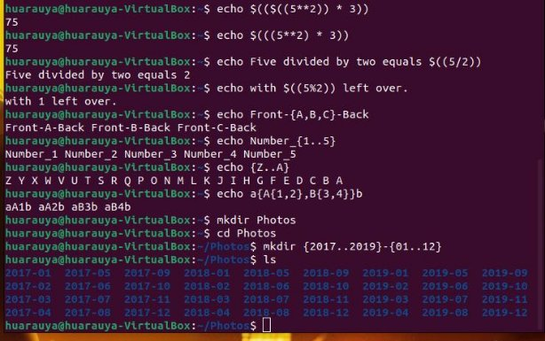

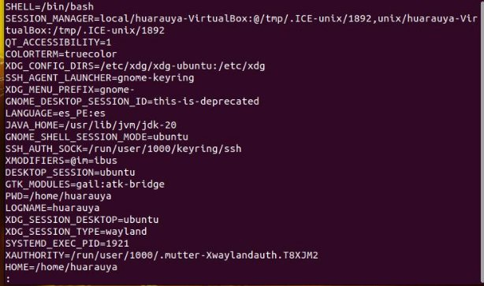

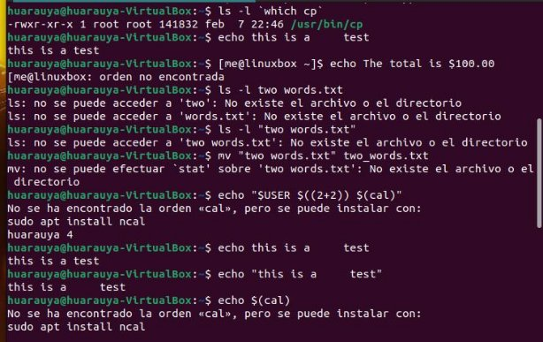

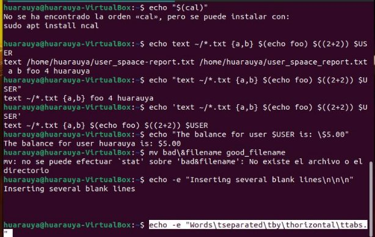

Aquí se muestra cómo manejar trabajos en segundo plano usando **bg** para enviar procesos al fondo, **fg** para traerlos de vuelta al primer plano, y **jobs** para listar todos los trabajos actuales. Estas funciones permiten una multitarea eficiente en la terminal.

9. **Permissions**

Esta imagen ilustra el uso de comandos como **top** para mostrar los procesos que más recursos consumen en tiempo real y **vmstat** para obtener reportes detallados sobre el uso de memoria, procesos y actividad del sistema. Son herramientas indispensables para diagnosticar problemas y asegurar el buen funcionamiento del sistema.

10. **Job Control**

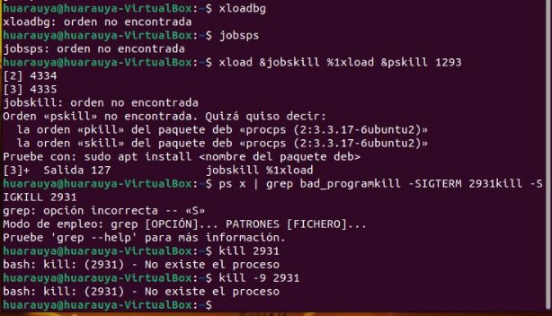
