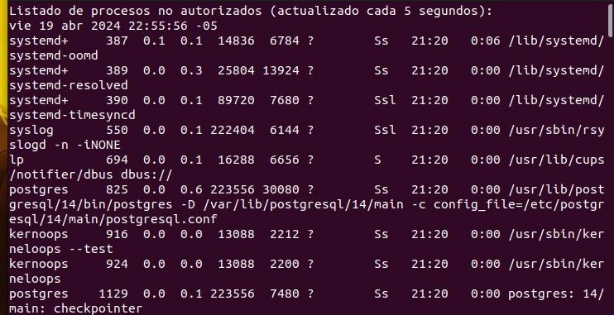

` `

**Evaluación: ps, grep, pipes linux, bash, awk**

**Nombre:** Josue eduardo Huarauya Fabian

**Objetivos**

- Aprender a listar y filtrar procesos activos en un sistema.
- Entender cómo identificar procesos por PID, usuario, uso de recursos y

  otros criterios.

- Utilizar **ps** para monitorear la salud y el rendimiento de aplicaciones paralelas y distribuidas.
- Aplicar **grep** para analizar logs de aplicaciones y sistemas, facilitando la depuración y el monitoreo.
- Utilizar pipes para crear cadenas de procesamiento de datos eficientes y scripts de análisis
- Aprender a escribir scripts de shell para automatizar tareas de administración

  y despliegue.

- Entender el control de flujo, manejo de variables, y funciones en Bash.
- Desarrollar habilidades para la automatización de pruebas y despliegues

  en entornos de computación distribuida.

- Aprender a utilizar **awk** para el filtrado y transformación de datos complejos

  en scripts de shell.

**Entregable:**

Presenta el código completo y tus respuestas desarrollado en tu repositorio personal hasta el dia 16 de abril (8:00 PM). Recuerda presentar tus resultados en formato markdown y código si es que se ha realizado.

**El comando ps**

El comando **ps** en Linux y otros sistemas tipo Unix es una herramienta de línea de comandos utilizada para mostrar información sobre los procesos activos en un sistema. **ps** es el acrónimo de "process status" o estado del proceso. Proporciona una instantánea de los procesos corriendo en ese momento, incluyendo detalles como el ID del proceso (PID), el usuario propietario del proceso, el uso de CPU, el uso de memoria, el tiempo de ejecución, el comando que inició el proceso, entre otros.

En un curso de computación paralela, concurrente y distributiva, el comando **ps** puede ser aplicado de diversas maneras para facilitar la comprensión y gestión de los procesos y la ejecución de programas en estos entornos:

- **Monitoreo de procesos**: **ps** puede ser usado para enseñar cómo identificar

  y monitorear procesos individuales o grupos de procesos relacionados con aplicaciones paralelas y concurrentes.

- **Gestión de recursos**: Utilizando **ps** junto con otras herramientas, se puede enseñar a observar el uso de CPU y memoria, lo cual es crucial para la optimización de aplicaciones en entornos paralelos y distribuidos.
- **Depuración y diagnóstico**: En la computación paralela y concurrente, identificar procesos bloqueados, zombies o que consumen recursos excesivamente es fundamental para la depuración y el mantenimiento del rendimiento del sistema.

  **ps** permite identificar rápidamente tales procesos.

- **Automatización y scripting**: **ps** se puede usar en scripts de shell para

  automatizar la supervisión y gestión de aplicaciones paralelas y distribuidas.

- **Estudio de casos**: Análisis de casos de estudio donde se requiere la identificación y gestión de procesos en sistemas de computación distribuida. Por ejemplo, cómo gestionar de manera eficiente múltiples instancias de un servicio web distribuido en

  un cluster de servidores.

**Ejercicios**

1. Listar todos los procesos con detalles completos
1. Buscar procesos específicos por nombre:
1. Mostrar procesos en un árbol jerárquico (útil para ver relaciones padre-hijo en procesos concurrentes):
1. Mostrar procesos de un usuario específico:
1. Escribe un script para verificar y reiniciar automáticamente un proceso si no está corriendo.

En estos scripts (recuerda son archivos Bash, terminan en .sh) verifica que efectivamente hacen lo que se indica:

**Monitoreo de procesos por uso excesivo de CPU**

#!/bin/bash

ps -eo pid,ppid,%cpu,cmd --sort=-%cpu | head -10 | while read pid ppid cpu cmd;

do if (( $(echo "$cpu > 80.0" | bc -l) )); then

echo "Proceso $pid ($cmd) está utilizando $cpu% de CPU." fi

done

con un umbral de 1%

**Identificar procesos zombis y reportar**

#!/bin/bash

ps -eo stat,pid,cmd | grep "^Z" | while read stat pid cmd; do echo "Proceso zombi detectado: PID=$pid CMD=$cmd" done

**Reiniciar automáticamente un servicio no está corriendo**

#!/bin/bash

SERVICE="apache2"

if ! ps -C $SERVICE > /dev/null; then

systemctl restart $SERVICE

echo "$SERVICE ha sido reiniciado." Fi

**Verificar la cantidad de instancias de un proceso y actuar si supera un umbral**

#!/bin/bash PROCESS\_NAME="httpd"

MAX\_INSTANCES=10

count=$(ps -C $PROCESS\_NAME --no-headers | wc -l)

if [ $count -gt $MAX\_INSTANCES ]; then

echo "Número máximo de instancias ($MAX\_INSTANCES) superado para $PROCESS\_NAME con $count instancias."

fi

**Listar todos los procesos de usuarios sin privilegios (UID > 1000)**

#!/bin/bash

ps -eo uid,pid,cmd | awk '$1 > 1000 {print}'

**Alertar sobre procesos que han estado corriendo durante más de X horas**

#!/bin/bash

MAX\_HOURS=24

ps -eo pid,etime | while read pid time; do

days=$(echo $time | grep -oP '^\d+-' | sed 's/-//')

hours=$(echo $time | grep -oP '\d+:' | sed 's/://')

total\_hours=$((days \* 24 + hours))

if [ $total\_hours -gt $MAX\_HOURS ]; then

echo "Proceso $pid ha estado corriendo por más de $MAX\_HOURS horas." fi

done

**Encontrar y listar todos los procesos que escuchan en un puerto específico**

#!/bin/bash

PORT="80"

lsof -i :$PORT | awk 'NR > 1 {print $2}' | while read pid; do

ps -p $pid -o pid,cmd

done

**Monitorear la memoria utilizada por un conjunto de procesos y alertar si supera un umbral**

#!/bin/bash

PROCESS\_NAME="mysqld"

MAX\_MEM=1024 # 1GB en MB

ps -C $PROCESS\_NAME -o pid,rss | while read pid rss; do

if [ $rss -gt $MAX\_MEM ]; then

echo "Proceso $pid ($PROCESS\_NAME) está utilizando más de $MAX\_MEM MB de memoria."

fi

done

**Generar un informe de procesos que incluya PID, tiempo de ejecución y comando**

#!/bin/bash

ps -eo pid,etime,cmd --sort=-etime | head -20 > proceso\_informe.txt echo "Informe generado en proceso\_informe.txt."

**El comando grep**

El comando **grep** es una herramienta de línea de comandos disponible en sistemas Unix y Linux utilizada para buscar texto dentro de archivos o flujos de datos. El nombre **grep** proviene de "global regular expression print", refiriéndose a su capacidad para filtrar líneas de texto que coinciden con expresiones regulares especificadas.

**grep** es extremadamente útil para analizar archivos de log, buscar ocurrencias de cadenas de texto en archivos de código, filtrar output de otros comandos, y muchas otras tareas de búsqueda de texto.

En el contexto de la computación paralela, concurrente y distributiva, así como en la automatización, **grep** se puede aplicar de diversas formas:

- **Análisis de logs de aplicaciones distribuidas**: **grep** puede ser utilizado para buscar rápidamente mensajes de error, advertencias o eventos específicos dentro de grandes volúmenes de archivos de log generados por aplicaciones

  distribuidas, facilitando el diagnóstico de problemas.

- **Monitoreo de salud del sistema**: Al integrarse en scripts de shell, **grep** puede automatizar el monitoreo del estado de servicios y procesos críticos,

  extrayendo información relevante de comandos como **ps**, **netstat**, o archivos

  como

  **/proc/meminfo**.

- **Validación de configuraciones en clusters**: **grep** puede ser utilizado para verificar rápidamente la consistencia de configuraciones de software en nodos de un cluster, buscando discrepancias o configuraciones erróneas en archivos distribuidos.
- **Automatización de tareas de gestión**: Integrado en scripts de shell, **grep** puede automatizar la gestión de recursos computacionales, por ejemplo, identificando y respondiendo a condiciones específicas detectadas en logs o salidas de

  comandos.

- **Análisis de rendimiento y carga de trabajo**: **grep** es útil para filtrar datos específicos de rendimiento y carga de trabajo de herramientas de monitoreo

  y métricas, permitiendo a los desarrolladores y administradores centrarse en información relevante para la optimización.

**Ejercicios**

En estos scripts (recuerda son archivos Bash, terminan en .sh) verifica que efectivamente hacen lo que se indica:

**Filtrar errores específicos en logs de aplicaciones paralelas:** grep "ERROR" /var/log/myapp/\*.log

**Verificar la presencia de un proceso en múltiples nodos**: pdsh -w nodo[1-10] "ps aux | grep 'my\_process' | grep -v grep"

**Contar el número de ocurriencias de condiciones de carrera registradas**: grep -c "race condition" /var/log/myapp.log

**Extraer IPs que han accedido concurrentemente a un recurso**:

grep "accessed resource" /var/log/webserver.log | awk '{print $1}' | sort | uniq

**Automatizar la alerta de sobrecarga en un servicio distribuido**:

grep "out of memory" /var/log/services/\*.log && mail -s "Alerta de Memoria" <admin@example.com> < /dev/null

**Monitorear errores de conexión en aplicaciones concurrentes**:

grep -i "connection error" /var/log/myapp\_error.log | mail -s "Errores de Conexión Detectados" <admin@example.com>

**Validar la correcta sincronización en operaciones distribuidas**:

grep "operation completed" /var/logs/distributed\_app/\*.log | awk '{print $5, $NF}' | sort

**Monitorizar la creación de procesos no autorizados**

#!/bin/bash

watch -n 5 'ps aux | grep -vE "(root|daemon|nobody)" | grep -v grep'

**Detectar y alertar sobre ataques de fuerza bruta SSH**

grep "Failed password" /var/log/auth.log | cut -d' ' -f11 | sort | uniq -c | sort -nr | head

**Identificar uso no autorizado de recursos en clústeres de computación**

#!/bin/bash

for host in $(cat hosts.txt); do

ssh $host "ps aux | grep -vE '(ALLOWED\_PROCESS\_1|ALLOWED\_PROCESS\_2)' | grep - v grep"

done

**Pipes**

Un "pipe" en Linux, simbolizado por |, es una poderosa característica de la línea de comandos que permite pasar la salida (output) de un comando directamente como entrada (input) a otro comando. Esto facilita la creación de secuencias de comandos o pipelines donde el resultado de un proceso es inmediatamente utilizado por otro, permitiendo una manipulación de datos eficiente y flexible sin necesidad de archivos intermedios.

En el contexto de la computación paralela, concurrente y distributiva, los pipes son fundamentales para procesar y analizar datos generados por múltiples procesos, monitorizar el rendimiento y estado de sistemas distribuidos y automatizar tareas administrativas complejas. Al combinar **ps**, **grep** y otros comandos de Linux, se pueden crear pipelines eficientes para la gestión y análisis de sistemas.

**Ejercicios**

Indica las actividades que realizan cada uno de los scripts (recuerda son archivos Bash y por tanto terminan en .sh y cada línea representa un script diferente)

watch "ps aux | grep '[a]pache2' | awk '{print \$1, \$2, \$3, \$4, \$11}'"

Este script utiliza `watch` para monitorear continuamente el uso de los procesos de Apache (`apache2`). `ps aux` lista todos los procesos activos, `grep '[a]pache2'` filtra aquellos que corresponden a Apache (evitando que `grep` se liste a sí mismo con `'[a]'`), y `awk` extrae y muestra las columnas de usuario (`$1`), PID (`$2`), uso de CPU (`$3`), uso de memoria (`$4`), y el comando que inició el proceso (`$11`). Este comando se actualiza cada 2 segundos por defecto, mostrando los datos en tiempo real.

cat /var/log/myapp.log | grep "ERROR" | awk '{print $NF}' | sort | uniq -c | sort -nr

Este script analiza el archivo de log `/var/log/myapp.log`, buscando líneas que contienen la palabra "ERROR". Utiliza `awk` para imprimir la última columna de estas líneas, que generalmente indica detalles específicos del error, y luego cuenta y ordena las ocurrencias de cada uno de estos detalles de mayor a menor.

systemctl --failed | grep "loaded units listed" || systemctl restart $(awk '{print $1}')

Este script revisa si hay servicios que han fallado con `systemctl --failed`. Si no se encuentra el texto "loaded units listed" (que aparece cuando no hay servicios fallidos), entonces intenta reiniciar el primer servicio fallido listado, usando `awk` para extraer su nombre.

ps -eo pid,ppid,%cpu,cmd --sort=-%cpu | awk '$3 > 80 {print "Alto uso de CPU: ", $1}' | mail - s "Alerta CPU" <admin@example.com>

Monitorea los procesos que superan el 80% de uso de CPU. Lista los procesos ordenados por uso de CPU, y si alguno supera el 80%, envía un correo electrónico con una alerta, incluyendo el PID de los procesos que cumplen esta condición.

ls /var/log/\*.log | xargs -n 1 -P 5 -I {} ssh nodo\_remoto "grep 'ERROR' {} > errores\_{}.txt"

Busca en todos los archivos `.log` en `/var/log/`, buscando la palabra "ERROR". Para cada archivo, ejecuta un `grep` en un nodo remoto (mediante SSH), y redirige los resultados a archivos de error individuales en el nodo remoto. Utiliza `xargs` para manejar hasta 5 archivos simultáneamente.

echo "8.8.8.8 [www.example.com](http://www.example.com/)" | xargs -n 1 ping -c 1 | grep "bytes from" || echo "$(date) Fallo de ping" >> fallos\_ping.txt

Realiza pings a `8.8.8.8` y a `www.example.com` (uno tras otro, no simultáneamente). Si alguno de los pings falla (no recibe "bytes from"), registra la fecha y el fallo en un archivo de texto `fallos\_ping.txt`

ps -eo user,%cpu,%mem,cmd | awk '/httpd/ {cpu+=$2; mem+=$3; count++} END {print "Apache - CPU:", cpu/count, "Mem:", mem/count}'

Este script busca todos los procesos de `httpd` (Apache), calcula el promedio del uso de CPU y memoria, y muestra estos promedios.

df /home | awk '$5 > 80 {print $1}' | xargs -I {} tar -czf "{}\_$(date +%F).tar.gz" {}

Examina el uso del sistema de archivos en `/home`, y si el uso del disco supera el 80%, crea un archivo tar.gz del sistema de archivos. La compresión se realiza por cada sistema de archivos que cumple la condición.

import subprocess

- Ejecutar el comando ps y obtener la salida

result = subprocess.run(['ps', '-eo', '%cpu,pid,cmd'], stdout=subprocess.PIPE) lines = result.stdout.decode('utf-8').strip().split('\n')

- Analizar cada línea de la salida de ps

for line in lines[1:]: # Saltar la primera línea que es la cabecera

cpu\_usage, pid, cmd = line.split(None, 2)

if float(cpu\_usage) > 80.0: # Umbral de uso de CPU

print(f"Alerta: Proceso {pid} ({cmd}) está utilizando {cpu\_usage}% de CPU")

El código Python ejecuta un comando del sistema para obtener información sobre los procesos en ejecución en una máquina Linux, específicamente mirando el uso de CPU, el identificador de proceso (PID), y el comando que inició cada proceso. A continuación, se describen las funcionalidades y el flujo del código paso a paso:

Ejecución del Comando ps:

Utiliza subprocess.run con los argumentos ['ps', '-eo', '%cpu,pid,cmd'] para ejecutar el comando ps del sistema. Este comando lista todos los procesos activos, mostrando tres características específicas de cada uno:

%cpu: El porcentaje de uso de la CPU.

pid: El identificador del proceso.

cmd: El comando completo que inició el proceso.

La salida de este comando se captura en stdout gracias a la especificación stdout=subprocess.PIPE.

Procesamiento de la Salida:

result.stdout.decode('utf-8').strip().split('\n'):

decode('utf-8') convierte la salida de bytes a una cadena de texto en UTF-8, que es necesario porque la salida de subprocess.run es un objeto bytes.

strip() elimina espacios en blanco adicionales al inicio y al final de la cadena de texto. split('\n') divide esta cadena en una lista de cadenas, donde cada elemento representa una línea de la salida del comando ps.

Análisis de la Salida:

El bucle for itera sobre cada línea de la salida comenzando desde la segunda línea (omitida la primera que es la cabecera de la salida de ps), separando cada línea en tres partes usando line.split(None, 2). Este método divide la línea basándose en espacios en blanco:

El primer elemento capturado es el uso de CPU (cpu\_usage).

El segundo es el PID (pid).

El tercero es el comando completo (cmd).

Condición y Alerta:

Dentro del bucle, cada línea es evaluada para ver si el uso de la CPU (cpu\_usage) excede el 80%. Esto se hace convirtiendo cpu\_usage a un valor flotante y comparándolo con 80.0.

Si un proceso excede este umbral, se imprime una alerta que muestra el PID y el comando del proceso, junto con su uso de CPU.

En resumen, el código está diseñado para monitorear y alertar sobre procesos que están consumiendo una cantidad excesiva de recursos de CPU, lo cual puede ser útil para identificar procesos que podrían estar afectando el rendimiento del sistema.

.................................................................................................................................. import subprocess

- Filtrar líneas con errores de un archivo de log

cmd = "grep 'ERROR' /var/log/myapp.log"

errors = subprocess.check\_output(cmd, shell=True).decode('utf-8').split('\n')

- Analizar errores y contar ocurrencias error\_counts = {}

  for error in errors:

if error in error\_counts:

error\_counts[error] += 1

else:

error\_counts[error] = 1

- Imprimir el recuento de errores

for error, count in error\_counts.items():

print(f"{error}: {count}")

El código Python ejecuta un conjunto de operaciones para filtrar, analizar y contar las ocurrencias de líneas que contienen la palabra "ERROR" en un archivo de log específico. Aquí te explico en detalle cómo funciona cada parte del código:

Ejecución del Comando de Filtrado:

Utilizando subprocess.check\_output, el código ejecuta el comando shell grep 'ERROR' /var/log/myapp.log. Este comando busca todas las líneas que contienen la palabra "ERROR" en el archivo especificado.

subprocess.check\_output captura la salida del comando en formato de bytes.

Decodificación y División de la Salida:

decode('utf-8') convierte la salida de bytes a una cadena de texto en UTF-8. Esto es necesario para manejar la salida como texto en Python.

split('\n') divide esta cadena en una lista de cadenas, donde cada cadena representa una línea de la salida del comando grep. Esto efectivamente crea una lista de todas las líneas que contienen la palabra "ERROR".

Análisis y Conteo de Errores:

Se inicializa un diccionario error\_counts para mantener el recuento de cada línea de error única.

Un bucle for itera sobre cada línea en la lista errors. Dentro del bucle:

Si la línea de error ya está en el diccionario (error\_counts), se incrementa su contador.

Si la línea de error no está en el diccionario, se añade con un contador inicial de 1.

Este método cuenta cuántas veces aparece cada línea de error específica en el archivo de log.

Impresión de Resultados:

Otro bucle for itera sobre los elementos del diccionario error\_counts. Para cada elemento (cada error y su contador):

Se imprime la línea de error junto con su número de ocurrencias, formateado para mostrar

ambos, el texto del error y el recuento asociado.

Consideraciones Adicionales:

Rendimiento: La utilización de grep a través de subprocess es eficiente para grandes archivos de log, ya que grep está altamente optimizado para buscar texto. Sin embargo, cargar todos los resultados en la memoria con split('\n') puede no ser óptimo para archivos extremadamente grandes.

Manejo de Errores: No hay manejo de errores en el código para situaciones como la ausencia del archivo de log o permisos insuficientes para leer el archivo. Sería prudente añadir manejo de excepciones para capturar y tratar errores que puedan surgir durante la ejecución del comando o el análisis de los datos.

Seguridad: Usar shell=True en subprocess.check\_output puede ser un riesgo de seguridad si las partes del comando son construidas a partir de entradas externas. En este caso, el comando es estático y seguro, pero es importante tener cuidado con esto al modificar el código o expandir su funcionalidad.

Este script es una herramienta útil para la monitorización y análisis básico de errores en archivos de log, proporcionando una visión clara de los tipos de errores y su frecuencia.

..................................................................................................................................

from multiprocessing import Pool import subprocess

def analyze\_log(file\_part):

"""Función para analizar una parte del archivo de log.""" with open(file\_part) as f:

return f.read().count('ERROR')

- Dividir el archivo de log en partes

subprocess.run(['split', '-l', '1000', 'large\_log.log', 'log\_part\_'])

- Lista de archivos divididos

parts = subprocess.check\_output('ls log\_part\_\*', shell=True).decode().split()

- Utilizar multiprocessing para analizar las partes en paralelo with Pool(4) as p:

results = p.map(analyze\_log, parts)

print("Total de errores encontrados:", sum(results))

El código Python utiliza técnicas de procesamiento en paralelo para analizar un archivo de log grande, buscando la cadena "ERROR". El archivo de log se divide primero en partes más pequeñas, y luego cada parte se procesa en paralelo para contar las ocurrencias de "ERROR". Aquí te explico detalladamente cada parte del código y cómo funciona:

Descripción del Código

Importaciones y Definición de Función:

Importas Pool de multiprocessing para permitir el procesamiento en paralelo y subprocess para ejecutar comandos del sistema.

Defines la función analyze\_log, que recibe como argumento file\_part, que es el nombre de una parte del archivo de log. La función abre y lee este archivo, contando y retornando el número de veces que aparece la palabra "ERROR".

División del Archivo de Log:

Utilizas subprocess.run para ejecutar el comando split, que divide el archivo large\_log.log en múltiples partes más pequeñas, cada una conteniendo 1000 líneas. Cada archivo parte se nombra con el prefijo log\_part\_.

Esto facilita el manejo de archivos grandes al reducir la carga de memoria al procesar cada archivo de manera individual.

Obtención de la Lista de Archivos Divididos:

Usas subprocess.check\_output para ejecutar ls log\_part\_\*, capturando la salida que lista los nombres de todos los archivos divididos creados en el paso anterior.

Decodificas y divides la salida para obtener una lista de nombres de archivos. Procesamiento en Paralelo de las Partes del Archivo:

Creas un Pool con 4 procesos. Esto significa que hasta 4 archivos pueden ser procesados en paralelo, mejorando significativamente el tiempo de ejecución en sistemas con múltiples

núcleos.

Usas p.map para mapear la función analyze\_log a cada uno de los archivos parte, lo que ejecuta la función en cada archivo en un proceso separado.

Recoges los resultados, que son el número de "ERROR" encontrados en cada parte.

Suma y Visualización de Resultados:

Sumas todos los resultados para obtener el total de "ERROR" encontrados en todo el archivo.

Imprimes el total de errores encontrados, proporcionando un resumen de la cantidad de errores en el archivo de log.

Consideraciones Adicionales

Manejo de Excepciones: Es recomendable añadir manejo de excepciones para controlar posibles errores, como problemas al leer archivos o al ejecutar comandos del sistema.

Seguridad: El uso de shell=True en subprocess.check\_output puede ser un riesgo si los inputs no son controlados. En este contexto, dado que el comando es estático y controlado, el riesgo es mínimo, pero siempre es algo a considerar.

Limpieza: Puedes considerar añadir código para limpiar los archivos parte después de procesarlos para no dejar residuos en el sistema de archivos.

Optimización: La cantidad de procesos en el Pool podría ser ajustada según el número de núcleos disponibles en la máquina para optimizar aún más el procesamiento.

Este enfoque es especialmente útil para analizar archivos de log grandes de manera eficiente, utilizando las capacidades de procesamiento en paralelo de Python para mejorar el rendimiento y la gestión de recursos.

.................................................................................................................................. import

subprocess

import time

previous\_ports = set()

while True:

- Ejecutar netstat y capturar la salida

result = subprocess.run(['netstat', '-tuln'], stdout=subprocess.PIPE)

ports = set(line.split()[3] for line in result.stdout.decode().split('\n') if 'LISTEN' in line)

- Detectar cambios en puertos abiertos

new\_ports = ports - previous\_ports

closed\_ports = previous\_ports - ports

if new\_ports or closed\_ports:

print(f"Nuevos puertos abiertos: {new\_ports}, Puertos cerrados: {closed\_ports}") previous\_ports = ports

time.sleep(60) # Esperar un minuto antes de volver a verificar

El código Python realiza una monitorización continua de los puertos abiertos en un sistema, utilizando el comando netstat. Este script verifica regularmente los puertos que están escuchando (abiertos) en la máquina y detecta cambios, como nuevos puertos que se abren o puertos existentes que se cierran. A continuación, te explico en detalle cómo funciona cada sección del código y qué hace:

Funcionamiento Detallado del Código

Importaciones:

subprocess es utilizado para ejecutar comandos del sistema desde Python.

time se importa para usar time.sleep(), permitiendo pausar la ejecución del script entre verificaciones.

Inicialización de Variables:

previous\_ports se inicializa como un conjunto vacío. Este conjunto almacenará los puertos que estaban abiertos en la última verificación, permitiendo comparar entre ejecuciones sucesivas del bucle.

Bucle Infinito:

El while True crea un bucle infinito, haciendo que el script se ejecute continuamente hasta que sea interrumpido manualmente.

Ejecución y Captura de la Salida de netstat:

subprocess.run(['netstat', '-tuln'], stdout=subprocess.PIPE) ejecuta el comando netstat con opciones específicas:

-t muestra las conexiones TCP.

-u muestra las conexiones UDP.

-l filtra para mostrar solo los puertos que están en estado de escucha (LISTEN).

-n muestra las direcciones y los números de puerto en formato numérico.

La salida se captura en formato de bytes y se convierte a texto con result.stdout.decode(). Extracción y Filtrado de Datos:

Una comprensión de lista se utiliza para procesar cada línea de la salida de netstat, extrayendo la dirección y el puerto que están en estado de LISTEN. Esto se logra dividiendo cada línea y seleccionando el cuarto elemento (line.split()[3]), que corresponde a la columna que muestra la dirección y el puerto.

Detección de Cambios en Puertos:

Se comparan los conjuntos de puertos actuales (ports) y anteriores (previous\_ports) para detectar diferencias:

new\_ports = ports - previous\_ports identifica puertos que son nuevos desde la última verificación.

closed\_ports = previous\_ports - ports identifica puertos que estaban abiertos antes pero ahora están cerrados.

Si hay cambios (new\_ports o closed\_ports no están vacíos), se imprime un mensaje indicando

estos cambios.

Actualización de Puertos y Pausa:

previous\_ports = ports actualiza el conjunto de puertos anteriores con los actuales para la próxima iteración.

time.sleep(60) pausa la ejecución del script por 60 segundos antes de la próxima verificación, reduciendo la carga en el sistema y evitando consultas demasiado frecuentes. Consideraciones Adicionales

Eficiencia y Carga del Sistema: Aunque el script pausa durante 60 segundos entre verificaciones, el uso constante de netstat y el procesamiento de su salida pueden consumir recursos del sistema. Ajusta la frecuencia de verificación según la carga del sistema y la sensibilidad requerida para detectar cambios.

Manejo de Errores: Considera añadir manejo de errores para capturar y gestionar posibles excepciones o errores al ejecutar el comando netstat, especialmente si se corre en un entorno donde los permisos o la disponibilidad del comando pueden ser un problema.

Seguridad y Permisos: Asegúrate de que el script se ejecute con los permisos necesarios para acceder a netstat y que su uso continuo no viole ninguna política de seguridad en entornos controlados.

.................................................................................................................................. import subprocess

- Obtener uso de memoria por proceso

result = subprocess.run(['ps', '-eo', 'user,rss'], stdout=subprocess.PIPE) lines = result.stdout.decode().split('\n')

- Calcular el uso total de memoria por usuario

memory\_usage = {}

for line in lines[1:-1]: # Ignorar la primera y última línea (cabecera y línea vacía)

user, rss = line.split(None, 1)

memory\_usage[user] = memory\_usage.get(user, 0) + int(rss)

for user, rss in memory\_usage.items():

print(f"Usuario: {user}, Memoria RSS total: {rss} KB")

Recopila el uso total de memoria por usuario de los procesos en ejecución

Ejecución de Comando con Subprocess:

El script ejecuta el comando ps con las opciones -eo user,rss para listar todos los procesos en ejecución junto con el usuario y el tamaño del conjunto residente (RSS), que es la parte de memoria ocupada por un proceso que se mantiene en RAM.

La salida de este comando se captura y se decodifica a texto.

Procesamiento de Datos:

La salida se divide en líneas. El script luego itera sobre estas líneas, omitiendo la cabecera y la última línea vacía (debido al carácter de nueva línea final).

Para cada línea, divide la línea en user y rss. El uso de memoria (rss, que debe ser un entero para la suma) se acumula en un diccionario memory\_usage donde cada clave es un usuario y el valor es el total de RSS para ese usuario.

Salida:

Imprime el uso total de memoria RSS para cada usuario, lo cual puede ser útil en entornos donde es necesario monitorizar el consumo de recursos por usuario.

..................................................................................................................................

import subprocess import datetime

snapshot\_interval = 60 # en segundos

while True:

timestamp = datetime.datetime.now().strftime('%Y-%m-%d %H:%M:%S') cpu\_usage = subprocess.check\_output("top -b -n1 | awk '/Cpu\(s\):/ {print $2}'",

shell=True).decode().strip()

memory\_usage = subprocess.check\_output("free | grep Mem | awk '{print $3/$2 \* 100.0}'", shell=True).decode().strip()

with open("system\_performance.log", "a") as log\_file:

log\_file.write(f"{timestamp}, CPU: {cpu\_usage}%, Memoria: {memory\_usage}%\n")

time.sleep(snapshot\_interval)

Registra periódicamente el uso de CPU y memoria del sistema en un archivo de log Configuración:

Establece un intervalo para tomar capturas del rendimiento del sistema, definido por snapshot\_interval (60 segundos).

Bucle de Monitoreo Continuo:

El script entra en un bucle infinito donde: Captura la marca de tiempo actual.

Utiliza el comando top para obtener el porcentaje de uso de CPU del sistema. Ejecuta este comando usando subprocess.check\_output con shell=True, necesario aquí para encadenar y filtrar la salida dentro del shell.

Utiliza el comando free para calcular el porcentaje de memoria utilizada, ejecutando nuevamente comandos de shell para parsear y calcular directamente desde la salida.

Registro en Log:

Abre (o crea si no existe) un archivo de log system\_performance.log y añade una línea para cada captura, que incluye la marca de tiempo, el uso de CPU y los porcentajes de uso de memoria.

Intervalo de Espera:

Después de registrar, el script duerme por la duración especificada por snapshot\_interval antes de tomar la próxima captura, reduciendo la demanda de recursos del propio script.

.................................................................................................................................. #!/bin/bash

while true; do

ps -eo %cpu,pid,cmd --sort=-%cpu | head -n 10 | awk '$1 > 80.0 {

printf("Alto uso de CPU (%s%%) por PID %s: %s\n", $1, $2, $3); }' | while read LINE; do

echo "$LINE" | mail -s "Alerta de CPU" [admin@domain.com ](mailto:admin@domain.com)done

sleep 60

done

..................................................................................................................................

#!/bin/bash

while true; do

ps -eo %cpu,pid,cmd --sort=-%cpu | head -n 10 | awk '$1 > 80.0 {

printf("Alto uso de CPU (%s%%) por PID %s: %s\n", $1, $2, $3); }' | while read LINE; do

echo "$LINE" | mail -s "Alerta de CPU" [admin@domain.com ](mailto:admin@domain.com)done

sleep 60

done

El script de Bash realiza un monitoreo continuo del uso de la CPU por procesos en un sistema Linux y envía una alerta por correo electrónico cuando un proceso supera el 80% de uso de CPU. El script se ejecuta indefinidamente y revisa el uso de CPU cada 60 segundos. Aquí te explico en detalle lo que cada parte del script hace:

Detalle del Script

Loop Infinito (while true):

El script entra en un bucle infinito, lo que significa que continuará ejecutándose hasta que sea interrumpido manualmente (por ejemplo, con Ctrl+C o un cierre de sesión).

Obtención y Filtrado de Información de Procesos (ps):

ps -eo %cpu,pid,cmd --sort=-%cpu | head -n 10: Este comando lista los procesos ordenados por el uso de CPU de mayor a menor, mostrando solo el porcentaje de uso de CPU (%cpu), el identificador de proceso (pid) y el comando que inició el proceso (cmd). Con head -n 10, limita la salida a los 10 procesos que más CPU están consumiendo.

Filtrado de Procesos con Alto Uso de CPU (awk):

awk '$1 > 80.0 { printf("Alto uso de CPU (%s%%) por PID %s: %s\n", $1, $2, $3); }': Este comando awk filtra y formatea la salida para incluir solo aquellos procesos cuyo uso de CPU es mayor al 80%. Si un proceso cumple con esta condición, awk imprime un mensaje formateado que incluye el porcentaje de uso de CPU, el PID, y el comando del proceso. Envío de Alertas por Correo Electrónico (mail):

| while read LINE; do echo "$LINE" | mail -s "Alerta de CPU" admin@domain.com done: Para cada línea de salida generada por awk (cada alerta de alto uso de CPU), el script lee la línea (read LINE), y luego usa echo para pasar esa línea como cuerpo de un correo electrónico, que es enviado usando el comando mail con un asunto específico. El correo se envía a una dirección administrativa (admin@domain.com).

Pausa Entre Ejecuciones (sleep 60):

sleep 60: Al final de cada ciclo del bucle, el script pausa durante 60 segundos antes de repetir el proceso. Esto ayuda a evitar una carga excesiva en el sistema debido a la monitorización y limita la frecuencia de las alertas.

.................................................................................................................................. #!/bin/bash

ps -eo user,rss | awk '{arr[$1]+=$2} END {

for (user in arr) {

print user, arr[user] " KB";

}

}' | sort -nrk 2 > /tmp/memory\_usage\_by\_user.txt

echo "Uso de memoria por usuario guardado en /tmp/memory\_usage\_by\_user.txt."

El script de Bash realiza una tarea de monitorización del uso de memoria por usuario en un sistema Linux. El script recopila información sobre el uso de la memoria y luego guarda esa información en un archivo. Aquí te explico en detalle cada parte del script y su funcionalidad:

Detalle del Script Comando ps y awk:

ps -eo user,rss: Este comando lista todos los procesos activos, mostrando el nombre del usuario (user) y el tamaño del conjunto residente (rss), que es la cantidad de memoria que el proceso ha utilizado y que actualmente reside en RAM.

awk '{arr[$1]+=$2} END { for (user in arr) { print user, arr[user] " KB"; } }': Aquí, awk se usa para procesar la salida de ps. Crea un array arr donde cada índice es un nombre de usuario y cada valor es la suma acumulada del rss para ese usuario. Al final del procesamiento (END), awk itera a través del array y imprime cada usuario junto con su uso total de memoria en kilobytes.

Ordenación y Almacenamiento de Resultados:

| sort -nrk 2 > /tmp/memory\_usage\_by\_user.txt: La salida de awk se canaliza a sort, que ordena los usuarios por su uso de memoria en orden descendente. La opción -nrk 2 significa "orden numérico reverso basado en la columna 2 (uso de memoria)". Luego, el resultado ordenado se redirige a un archivo en /tmp/memory\_usage\_by\_user.txt, almacenando allí los datos.

Mensaje de Confirmación:

echo "Uso de memoria por usuario guardado en /tmp/memory\_usage\_by\_user.txt.": Al final del script, se muestra un mensaje en la consola que confirma que los datos de uso de memoria han sido guardados en el archivo especificado.

Uso Práctico y Consideraciones

Monitoreo de Recursos: Este script es útil para administradores de sistemas que necesitan revisar cómo se distribuye la memoria entre los usuarios de un servidor o una estación de trabajo, lo cual puede ayudar en la gestión de recursos y en la identificación de usuarios o procesos que consumen una cantidad desproporcionada de memoria.

Automatización: Podrías ejecutar este script regularmente a través de un cron job para obtener actualizaciones periódicas del uso de memoria por usuario.

Seguridad y Permiso de Escritura: Asegúrate de que el script se ejecute con los permisos necesarios para escribir en /tmp y que no haya restricciones de seguridad que impidan su ejecución correcta.

Mejoras y Personalización: Considera la posibilidad de añadir más detalles al archivo de salida o de configurar alertas en casos donde el uso de memoria supere ciertos umbrales críticos.

Este script proporciona una forma directa y eficiente de recopilar y almacenar información sobre el uso de memoria por usuario, lo cual es fundamental para la gestión de sistemas y la planificación de capacidades.

.................................................................................................................................. #!/bin/bash

echo "Top CPU y Memoria por Usuario"

ps -eo user,%cpu,%mem --sort=-%cpu | awk 'NR==1 {print $0; next} !seen[$1]++' | while read USER CPU MEM; do

echo "Usuario: $USER, CPU: $CPU%, Mem: $MEM%" done

El script de Bash es una herramienta de monitoreo que informa sobre el uso de CPU y memoria de los usuarios más intensivos en un sistema. Se centra en mostrar el usuario que más recursos consume en términos de CPU y memoria. Aquí detallo cada componente del script y su funcionalidad:

Detalle del Script

Mensaje Inicial:

echo "Top CPU y Memoria por Usuario": Esto simplemente imprime un mensaje inicial en la consola que describe lo que el script está a punto de hacer.

Comando ps para Listar Procesos:

ps -eo user,%cpu,%mem --sort=-%cpu: Este comando utiliza ps para listar todos los procesos en ejecución, mostrando el usuario (user), el porcentaje de uso de CPU (%cpu), y el porcentaje de uso de memoria (%mem). La opción --sort=-%cpu ordena la salida por uso de CPU en orden descendente, de modo que los procesos que consumen más CPU aparecen primero.

Filtrado y Formateo con awk:

awk 'NR==1 {print $0; next} !seen[$1]++': Este script de awk hace lo siguiente:

NR==1 {print $0; next}: Imprime la primera línea (cabecera) y pasa a la siguiente iteración, asegurando que la cabecera se muestre en la salida.

!seen[$1]++: Para las líneas siguientes a la primera, utiliza un truco de awk con un array asociativo (seen) para imprimir solo la primera aparición de cada usuario. Esto asegura que solo se muestre el proceso que más CPU consume por cada usuario.

Bucle para Leer y Mostrar Resultados:

| while read USER CPU MEM; do echo "Usuario: $USER, CPU: $CPU%, Mem: $MEM%" done: Este bucle lee la salida de awk línea por línea, asignando las columnas a las variables USER, CPU, y MEM. Luego, imprime esta información de forma amigable, mostrando los porcentajes de uso de CPU y memoria junto con el nombre de usuario correspondiente. Funcionalidad General y Uso Práctico

Monitoreo de Recursos: El script es útil para administradores de sistemas que necesitan identificar rápidamente qué usuarios están consumiendo más recursos en un servidor, especialmente en entornos donde múltiples usuarios ejecutan procesos intensivos. Simplicidad y Eficacia: El script es simple pero efectivo para su propósito, proporcionando una visión clara del uso de recursos sin requerir herramientas adicionales de monitoreo. Personalización: Podrías modificar el script para incluir más detalles o adaptarlo para monitorear otros aspectos, como el tiempo de ejecución de los procesos, o para enviar alertas si ciertos umbrales de uso son superados.

Este script proporciona una instantánea clara y concisa del uso de los recursos por usuario, facilitando la gestión y optimización de los mismos en sistemas multiusuario.

.................................................................................................................................. #!/bin/bash

PROCESS\_NAME="java"

echo "Reporte de Memoria para procesos $PROCESS\_NAME"

ps -C $PROCESS\_NAME -o pid,user,%mem,cmd --sort=-%mem | awk 'NR==1; NR>1 {print $0; total+=$3} END {print "Memoria Total Usada:", total "%"}'

El script de Bash está diseñado para generar un reporte de memoria específicamente para procesos asociados a un nombre de proceso dado, en este caso, "java". El script realiza un seguimiento del uso de memoria de todos los procesos de Java en ejecución, mostrando detalles individuales y el total acumulado de memoria usada por estos procesos. A continuación, te explico cómo funciona cada parte del script:

Desglose del Script

Definición de la Variable PROCESS\_NAME:

PROCESS\_NAME="java": Aquí se establece la variable PROCESS\_NAME con el valor "java", que se utiliza para identificar los procesos de interés en el sistema.

Mensaje Inicial:

echo "Reporte de Memoria para procesos $PROCESS\_NAME": Este comando imprime un mensaje en la consola indicando el inicio del reporte de memoria para los procesos especificados (en este caso, Java).

Comando ps para Listar Procesos:

ps -C $PROCESS\_NAME -o pid,user,%mem,cmd --sort=-%mem:

-C $PROCESS\_NAME: Filtra los procesos por nombre, limitando la salida a aquellos cuyo nombre de comando coincide con "java".

-o pid,user,%mem,cmd: Especifica que se muestren el PID (identificador del proceso), el usuario bajo el cual se ejecuta el proceso, el porcentaje de memoria usada (%mem), y el comando completo que inició el proceso.

--sort=-%mem: Ordena los resultados por el uso de memoria en orden descendente, mostrando primero los procesos que más memoria consumen.

Procesamiento y Suma con awk:

awk 'NR==1; NR>1 {print $0; total+=$3} END {print "Memoria Total Usada:", total "%"}': NR==1: Imprime la primera línea, que es la cabecera de los campos mostrados por ps.

NR>1 {print $0; total+=$3}: Para todas las líneas después de la cabecera, imprime la línea completa y suma el porcentaje de memoria usado (que está en la tercera columna, $3) a la variable total.

END {print "Memoria Total Usada:", total "%"}': Al final de procesar todas las líneas, imprime el total acumulado de memoria usada por todos los procesos de Java.

Uso Práctico y Consideraciones

Monitoreo de Recursos: Este script es especialmente útil en entornos donde los procesos de Java juegan un papel crítico, como servidores que alojan aplicaciones Java empresariales o de desarrollo. Permite a los administradores del sistema o desarrolladores obtener rápidamente una visión del impacto de estos procesos en los recursos del sistema.

Personalización: Puedes adaptar el script para monitorear otros tipos de procesos simplemente cambiando el valor de PROCESS\_NAME. Además, podrías modificar las columnas de salida según las necesidades específicas de monitoreo.

Automatización: El script se puede programar para ejecutarse en intervalos regulares mediante un cron job o integrarse en herramientas de monitoreo más sofisticadas para alertar sobre el uso excesivo de recursos.

Este script proporciona una herramienta eficaz para el seguimiento y reporte del uso de memoria, facilitando la gestión de recursos y ayudando a identificar posibles problemas de rendimiento relacionados con procesos específicos en tiempo real.

.................................................................................................................................. #!/bin/bash

LOG="/var/log/httpd/access\_log"

echo "Top IPs"

awk '{print $1}' $LOG | sort | uniq -c | sort -nr | head -5 | while read COUNT IP; do

LOCATION=$(geoiplookup $IP | cut -d, -f2)

echo "$IP ($COUNT accesos) - $LOCATION" done

El script de Bash realiza una tarea de análisis de los registros de acceso de un servidor web, específicamente el archivo access\_log del servidor HTTP Apache. Este script identifica las cinco direcciones IP que más han accedido al servidor y utiliza GeoIP para determinar y mostrar la ubicación geográfica de cada IP. Aquí te explico cómo funciona cada parte del script:

Desglose del Script

Configuración de la Ruta del Archivo de Log:

LOG="/var/log/httpd/access\_log": Esta línea establece una variable LOG que contiene la ruta al archivo de log de acceso de Apache. Esta variable se utiliza para referenciar el archivo de log en el script.

Mensaje Inicial:

echo "Top IPs": Imprime un mensaje en la consola que indica que el script mostrará las direcciones IP con más accesos.

Análisis del Archivo de Log con awk:

awk '{print $1}' $LOG: Utiliza awk para extraer la primera columna de cada línea del archivo de log, que generalmente corresponde a la dirección IP del cliente que hizo la solicitud. Ordenamiento y Conteo de IPs:

| sort | uniq -c | sort -nr: Este conjunto de comandos organiza las IPs:

sort: Ordena las IPs para que uniq pueda contarlas adecuadamente.

uniq -c: Cuenta y elimina duplicados, mostrando el número de apariciones de cada IP.

sort -nr: Ordena las IPs de nuevo, esta vez numéricamente y en orden descendente por el número de accesos.

Filtrado de las Cinco Principales IPs:

| head -5: Reduce la lista a las cinco direcciones IP más frecuentes.

Obtención de la Ubicación Geográfica y Mostrar Resultados:

| while read COUNT IP; do: Este bucle lee cada línea de la salida que contiene el número de accesos y la dirección IP.

LOCATION=$(geoiplookup $IP | cut -d, -f2): Utiliza el comando geoiplookup para obtener la ubicación geográfica de la IP y cut para extraer la parte relevante de la salida (generalmente el país).

echo "$IP ($COUNT accesos) - $LOCATION": Imprime la dirección IP, el número de accesos y la ubicación geográfica en un formato amigable.

Consideraciones Adicionales

Dependencia de GeoIP: Este script requiere que geoiplookup esté instalado en el sistema. Este comando forma parte de muchos paquetes de GeoIP que pueden ser instalados a través de los gestores de paquetes de la mayoría de las distribuciones Linux. Automatización y Monitoreo: Este script puede ser utilizado para generar reportes regulares o para integrarse en un sistema de monitoreo más grande para rastrear el origen geográfico del tráfico web, útil para análisis de seguridad o estadísticas de acceso. Seguridad y Privacidad: Al manejar direcciones IP y datos de ubicación, siempre considera las implicaciones de privacidad y cumple con las regulaciones locales sobre datos.

Este script es una herramienta valiosa para los administradores de sistemas y los analistas de seguridad para comprender mejor la distribución geográfica del tráfico hacia sus servidores web.

..................................................................................................................................

#!/bin/bash

NET\_DEV="eth0"

echo "Estadísticas de red para $NET\_DEV"

rx\_prev=$(cat /sys/class/net/$NET\_DEV/statistics/rx\_bytes) tx\_prev=$(cat /sys/class/net/$NET\_DEV/statistics/tx\_bytes) sleep 5

rx\_now=$(cat /sys/class/net/$NET\_DEV/statistics/rx\_bytes) tx\_now=$(cat /sys/class/net/$NET\_DEV/statistics/tx\_bytes) rx\_rate=$(( ($rx\_now - $rx\_prev) / 5 ))

tx\_rate=$(( ($tx\_now - $tx\_prev) / 5 ))

echo "RX Rate: $rx\_rate bytes/sec"

echo "TX Rate: $tx\_rate bytes/sec"

El script de Bash se utiliza para monitorear y reportar la tasa de transmisión (TX) y recepción (RX) de datos en una interfaz de red específica, en este caso eth0. El script calcula las tasas de datos en bytes por segundo basándose en la diferencia de los bytes transmitidos y recibidos durante un intervalo de 5 segundos. A continuación, te explico cómo funciona cada parte del script:

Desglose del Script

Configuración de la Interfaz de Red:

NET\_DEV="eth0": Define una variable NET\_DEV que especifica la interfaz de red a monitorear. Puedes cambiar "eth0" a cualquier otra interfaz activa en tu sistema, como "wlan0" para Wi-Fi.

Mensaje Inicial:

echo "Estadísticas de red para $NET\_DEV": Imprime un mensaje inicial que indica para qué interfaz de red se mostrarán las estadísticas.

Lectura Inicial de Estadísticas de Red:

rx\_prev=$(cat /sys/class/net/$NET\_DEV/statistics/rx\_bytes): Lee y almacena el número total de bytes recibidos (RX) desde el arranque del sistema para la interfaz especificada. tx\_prev=$(cat /sys/class/net/$NET\_DEV/statistics/tx\_bytes): Similarmente, lee y almacena el número total de bytes transmitidos (TX).

Pausa para Medir el Tráfico de Red:

sleep 5: Pausa el script durante 5 segundos. Este intervalo permite que la red acumule más tráfico y facilita la medición del cambio en los bytes transmitidos y recibidos.

Lectura de Estadísticas de Red Después de la Pausa:

rx\_now=$(cat /sys/class/net/$NET\_DEV/statistics/rx\_bytes): Lee el número total actual de

bytes recibidos después del intervalo de espera.

tx\_now=$(cat /sys/class/net/$NET\_DEV/statistics/tx\_bytes): Lee el número total actual de bytes transmitidos después del intervalo de espera.

Cálculo de las Tasas de Datos:

rx\_rate=$(( ($rx\_now - $rx\_prev) / 5 )): Calcula la tasa de recepción (RX) en bytes por segundo dividiendo la diferencia entre rx\_now y rx\_prev por el número de segundos de pausa (5 segundos).

tx\_rate=$(( ($tx\_now - $tx\_prev) / 5 )): Calcula la tasa de transmisión (TX) de la misma manera.

Presentación de Resultados:

echo "RX Rate: $rx\_rate bytes/sec": Imprime la tasa de recepción de datos en bytes por segundo.

echo "TX Rate: $tx\_rate bytes/sec": Imprime la tasa de transmisión de datos en bytes por segundo.

Uso Práctico y Consideraciones

Monitorización Continua: Aunque este script proporciona una instantánea de 5 segundos de las tasas de transmisión y recepción, podría modificarse para ejecutarse en un bucle o ser utilizado dentro de un cron job para proporcionar monitoreo continuo.

Validación de Interfaz: Antes de ejecutar el script, asegúrate de que la interfaz especificada (eth0 en este caso) es correcta y está activa en tu sistema. Puedes verificar las interfaces disponibles usando ifconfig o ip a.

Permiso de Ejecución: Este script debe tener permisos adecuados para acceder a los archivos en /sys/class/net/, lo cual generalmente no requiere privilegios elevados. Sin embargo, dependiendo de la configuración del sistema, puede necesitar ajustes en los permisos.

Este script es una herramienta útil para administradores de sistemas y profesionales de TI que necesitan monitorear el rendimiento de la red en tiempo real de manera simple y efectiva.

**Bash**

Para profundizar en el aprendizaje y comprensión de Bash en el contexto de computación paralela, concurrente y distribuida, necesitarán una base sólida en varios conceptos y herramientas de línea de comandos. A continuación, les presento una lista de referencias y recursos que pueden ser útiles permitiéndoles no solo entender los scripts proporcionados aquí, sino también desarrollar sus propios scripts para resolver problemas complejos en estos entornos.

"The Linux Command Line" por William Shotts <https://linuxcommand.org/tlcl.php>

La documentación oficial de Bash es un recurso indispensable para comprender todas las características y capacidades del shell. https://[www.gnu.org/software/bash/manual/](http://www.gnu.org/software/bash/manual/)

Explainshell : https://explainshell.com/

Un sitio web que desglosa comandos de Bash, mostrando una explicación detallada de cada parte de un comando.

Ryan's Tutorials - Bash Scripting Tutorial https://ryanstutorials.net/bash-scripting-tutorial/

Una herramienta de linting para scripts de Bash que ayuda a encontrar errores y problemas comunes en el código. ShellCheck: https://[www.shellcheck.net/](http://www.shellcheck.net/)

Una herramienta para ejecutar tareas en paralelo utilizando la línea de comandos. Es muy útil para procesamiento de datos y tareas computacionales que pueden ser paralelizadas. GNU Parallel https://[www.gnu.org/software/parallel/](http://www.gnu.org/software/parallel/)

Para escribir scripts efectivos en Bash, especialmente en el contexto de computación paralela, concurrente y distribuida, es esencial dominar ciertos fundamentos y conceptos avanzados de Bash. A continuación, presento un resumen de los aspectos clave de Bash que debes conocer, acompañados de ejemplos ilustrativos.

**Variables**: Almacenar y manipular datos.

nombre="Mundo" echo "Hola, $nombre"

**Estructuras de Control**: Permiten tomar decisiones y repetir acciones.

- If statement

if [ "$nombre" == "Mundo" ]; then

echo "Correcto"

fi

- Loop

for i in {1..5}; do

echo "Iteración $i"

done

**Funciones**: Agrupar código para reutilizar.

saludo() {

echo "Hola, $1"

}

saludo "Mundo"

**Comandos comunes** (**grep**, **awk**, **sed**, **cut**, **sort**, **uniq**): Procesamiento de texto y datos. echo -e "manzana\nbanana\nmanzana" | sort | uniq

**Pipes y redirecciones**: Conectar la salida de un comando con la entrada de otro.

cat archivo.txt | grep "algo" > resultado.txt

**Expresiones regulares**: Patrones para buscar y manipular texto.

echo "error 404" | grep -Eo "[0-9]+"

**Manejo de argumentos**: Scripts que aceptan entrada del usuario.

#!/bin/bash

echo "Ejecutando script con el argumento: $1"

**Automatización y monitoreo**: Scripts para automatizar tareas y monitorear sistemas. #!/bin/bash

if ps aux | grep -q "[a]pache2"; then

echo "Apache está corriendo."

else

echo "Apache no está corriendo." fi

**Procesamiento Paralelo con GNU Parallel**: Ejecutar tareas en paralelo para optimizar el tiempo de procesamiento.

cat lista\_urls.txt | parallel wget

**Validación de entradas**: Prevenir la ejecución de comandos maliciosos. read -p "Introduce tu nombre: " nombre

echo "Hola, $nombre" # Asegúrate de validar o escapar $nombre si se usa en comandos más complejos.

**Optimización de scripts**: Utilizar herramientas y técnicas para reducir el tiempo de ejecución.

find . -name "\*.txt" | xargs grep "patrón" **Ejercicios**

Indica las actividades que realizan cada uno de los scripts (recuerda son archivos Bash y por tanto terminan en .sh.

#!/bin/bash

- Configuración

UMBRAL\_CPU=70.0 # Uso máximo de CPU permitido (%) UMBRAL\_MEM=500 # Uso máximo de memoria permitido (MB) LOG\_FILE="/var/log/monitoreo\_procesos.log" EMAIL\_ADMIN="<admin@ejemplo.com>"

PROCESOS\_PARALELOS=("proceso1" "proceso2" "proceso3") # Nombres de los procesos a monitorear

- Función para convertir memoria de KB a MB convertir\_kb\_a\_mb() {

echo "$(( $1 / 1024 ))"

}

- Función para obtener y verificar el uso de recursos de los procesos verificar\_procesos() {

for PROC in "${PROCESOS\_PARALELOS[@]}"; do

ps -C $PROC -o pid=,%cpu=,%mem=,vsz=,comm= --sort=-%cpu | while read PID CPU MEM VSZ COMM; do

MEM\_MB=$(convertir\_kb\_a\_mb $VSZ)

if (( $(echo "$CPU > $UMBRAL\_CPU" | bc -l) )) || [ "$MEM\_MB" -gt "$UMBRAL\_MEM" ]; then

echo "$(date +"%Y-%m-%d %H:%M:%S") - Proceso $COMM (PID $PID) excede los umbrales con CPU: $CPU%, MEM: ${MEM\_MB}MB" >> $LOG\_FILE

kill -9 $PID && echo "$(date +"%Y-%m-%d %H:%M:%S") - Proceso $PID terminado." >> $LOG\_FILE

echo "Proceso $PID ($COMM) terminado por alto uso de recursos" | mail -s "Alerta de Proceso Terminado" $EMAIL\_ADMIN

fi done

done

}

- Loop principal para el monitoreo continuo while true; do

verificar\_procesos

sleep 60 # Espera 60 segundos antes de la próxima verificación done

El script de Bash está diseñado para monitorear continuamente el uso de recursos de procesos específicos en un sistema Linux y tomar acciones correctivas si estos procesos exceden ciertos umbrales de uso de CPU o memoria. A continuación, te detallo las actividades que realiza cada parte del script:

Configuración Inicial

Variables de Umbral: Define límites para el uso de CPU (UMBRAL\_CPU) y memoria (UMBRAL\_MEM), más allá de los cuales se considera que un proceso está consumiendo demasiados recursos.

Archivo de Log: Establece LOG\_FILE como la ubicación donde se guardarán los registros de los eventos y acciones del script.

Email de Administrador: Guarda en EMAIL\_ADMIN la dirección de correo electrónico a la que se enviarán las alertas.

Procesos a Monitorear: Lista PROCESOS\_PARALELOS que contiene los nombres de los procesos que se desea monitorear.

Funciones Definidas

convertir\_kb\_a\_mb(): Convierte valores de memoria de kilobytes a megabytes para facilitar la comparación con el umbral establecido en MB.

verificar\_procesos(): Función principal que realiza las siguientes tareas:

Itera sobre cada proceso especificado en PROCESOS\_PARALELOS.

Usa el comando ps para obtener información del proceso como PID, uso de CPU, uso de memoria, tamaño virtual (VSZ), y nombre del comando.

Convierte el tamaño VSZ de KB a MB.

Comprueba si el proceso excede los umbrales de CPU o memoria establecidos.

Si se excede algún umbral, registra esta información en el archivo de log, termina el proceso afectado, y envía una notificación por correo electrónico.

Loop Principal de Monitoreo

Loop Infinito (while true): Asegura que el monitoreo se ejecute continuamente.

Llama a verificar\_procesos para ejecutar la revisión de los procesos.

Pausa la ejecución del script durante 60 segundos (sleep 60) entre cada ciclo de verificación para limitar el uso de recursos del propio script y evitar sobrecargar el sistema con verificaciones constantes.

Funcionalidad General

El script tiene como objetivo asegurar que los procesos críticos no consuman una cantidad excesiva de recursos que podría afectar al rendimiento general del sistema.

Permite la administración proactiva de los recursos al cerrar automáticamente los procesos que se vuelven demasiado demandantes y notificando al administrador del sistema para que pueda tomar medidas adicionales si es necesario.

Consideraciones Adicionales

Seguridad y Control: Utilizar kill -9 para terminar procesos puede ser peligroso ya que no permite que los procesos terminen de manera limpia (cerrando archivos, liberando recursos, etc.). Podría ser más prudente usar señales más suaves antes de escalar a SIGKILL (kill -9). Mejoras: Podría ser útil agregar configuraciones para reintentar ciertas acciones o para escalonar respuestas basadas en el tiempo que un proceso ha estado excediendo los umbrales.

Configuración Flexible: Considerar la posibilidad de permitir que los umbrales y la lista de procesos sean configurados externamente, por ejemplo, a través de un archivo de configuración o variables de entorno, para facilitar ajustes sin modificar el script.

Este script es una herramienta eficaz para la gestión de sistemas en entornos donde ciertos procesos son conocidos por su potencial de consumir recursos excesivos.

.................................................................................................................................. #!/bin/bash

DIRECTORIOS=("dir1" "dir2" "dir3")

DESTINO\_BACKUP="/mnt/backup"

backup\_dir()

{ dir=$1

fecha=$(date +%Y%m%d)

tar -czf "${DESTINO\_BACKUP}/${dir##\*/}\_$fecha.tar.gz" "$dir" echo "Backup completado para $dir"

}

export -f backup\_dir

export DESTINO\_BACKUP

parallel backup\_dir ::: "${DIRECTORIOS[@]}"

Este script automatiza el proceso de realizar copias de seguridad de varios directorios y utiliza parallel para hacerlo en paralelo, lo cual es útil para ahorrar tiempo en entornos donde múltiples directorios necesitan ser respaldados regularmente.

Definición de Variables:

DIRECTORIOS: Array que contiene los nombres de los directorios de los cuales se realizarán las copias de seguridad.

DESTINO\_BACKUP: Ruta del directorio donde se guardarán los archivos de backup. Función backup\_dir:

Esta función toma un directorio como argumento, genera un nombre de archivo que incluye la fecha actual y crea un archivo tar.gz del directorio en la ubicación de destino especificada.

Imprime un mensaje una vez que el backup del directorio ha sido completado. Exportación de Función y Variables:

export -f backup\_dir: Exporta la función backup\_dir para que pueda ser usada por parallel.

export DESTINO\_BACKUP: Exporta la variable DESTINO\_BACKUP para asegurar que esté disponible en el entorno de los subprocesos iniciados por parallel.

Uso de parallel:

parallel backup\_dir ::: "${DIRECTORIOS[@]}": Ejecuta la función backup\_dir en paralelo para cada directorio listado en la variable DIRECTORIOS. Esto permite que las copias de seguridad de múltiples directorios se realicen simultáneamente, optimizando el tiempo de ejecución.

.................................................................................................................................. #!/bin/bash

NODOS=("nodo1" "nodo2" "nodo3")

TAREAS=("tarea1.sh" "tarea2.sh" "tarea3.sh")

distribuir\_tareas() {

for i in "${!TAREAS[@]}"; do

nodo=${NODOS[$((i % ${#NODOS[@]}))]} tarea=${TAREAS[$i]}

echo "Asignando $tarea a $nodo"

scp "$tarea" "${nodo}:/tmp"

ssh "$nodo" "bash /tmp/$tarea" &

done

wait

} distribuir\_tareas

Este script está diseñado para distribuir y ejecutar scripts de shell en una serie de nodos de computadora, facilitando la automatización de tareas en entornos distribuidos.

Definición de Variables:

NODOS: Array que contiene los nombres de los nodos donde se ejecutarán las tareas. TAREAS: Array que contiene los nombres de los scripts de shell que se distribuirán y ejecutarán en los nodos.

Función distribuir\_tareas:

Itera sobre el array TAREAS, asignando cada tarea a un nodo. La asignación se realiza de forma cíclica utilizando la operación módulo para balancear las tareas entre los nodos disponibles.

Para cada tarea, se realiza una copia al nodo objetivo usando scp y luego se ejecuta la tarea en el nodo mediante ssh. Las tareas se ejecutan en el background (&) para permitir que todas las tareas se inicien casi simultáneamente.

wait: Espera a que todas las tareas en background terminen antes de finalizar el script.

.................................................................................................................................. #!/bin/bash

LOCK\_FILE="/var/lock/mi\_recurso.lock"

RECURSO="/path/to/recurso\_compartido"

adquirir\_lock() {

while ! (set -o noclobber; > "$LOCK\_FILE") 2> /dev/null; do

echo "Esperando por el recurso..."

sleep 1

done

}

liberar\_lock() {

rm -f "$LOCK\_FILE" }

adquirir\_lock

- Trabajar con el recurso echo "Accediendo al recurso" sleep 5 # Simular trabajo liberar\_lock

El script de Bash está diseñado para manejar el acceso exclusivo a un recurso compartido utilizando un mecanismo de bloqueo basado en archivos. Este enfoque es útil en escenarios donde múltiples procesos o scripts necesitan acceder de manera segura a un recurso común (como un archivo o directorio) sin interferir entre sí. Aquí explico cómo funciona cada parte del script:

Desglose del Script

Definición de Variables:

LOCK\_FILE="/var/lock/mi\_recurso.lock": Define la ubicación del archivo de bloqueo que se utiliza para controlar el acceso al recurso.

RECURSO="/path/to/recurso\_compartido": Define la ruta al recurso que se necesita proteger. Este podría ser cualquier tipo de recurso compartido que requiera acceso sincronizado. Función adquirir\_lock():

Este bloque de código intenta crear un archivo de bloqueo para obtener control exclusivo sobre el recurso. Utiliza un bucle while para intentar crear el archivo de bloqueo:

set -o noclobber: Configura la shell para que no sobrescriba archivos existentes durante la redirección de salida. > "$LOCK\_FILE": Intenta redirigir la salida vacía a un archivo de bloqueo. Si el archivo ya existe (indicando que otro proceso lo ha bloqueado), la operación fallará debido a la opción noclobber. Si no puede crear el archivo (lo que indica que el recurso está bloqueado por otro proceso), imprime un mensaje y espera un segundo antes de intentarlo nuevamente, efectivamente poniendo el proceso en espera hasta que el recurso esté disponible.

Función liberar\_lock():

rm -f "$LOCK\_FILE": Elimina el archivo de bloqueo, liberando el recurso para que otros procesos puedan acceder a él. La opción -f asegura que el comando no falle ni pida confirmación incluso si el archivo no existe.

Uso del Recurso:

adquirir\_lock: Llama a la función para intentar obtener el bloqueo del recurso.

echo "Accediendo al recurso": Una vez obtenido el bloqueo, el script simula el trabajo con el recurso.

sleep 5: Simula un trabajo con el recurso que dura cinco segundos.

liberar\_lock: Llama a la función para liberar el bloqueo, permitiendo que otros procesos accedan al recurso.

Consideraciones y Uso Práctico

Robustez y Seguridad: Aunque el mecanismo de bloqueo basado en archivos es una estrategia común para la sincronización en scripts de Bash, es importante asegurarse de que el script maneje correctamente situaciones como interrupciones inesperadas. Por ejemplo, podría no liberarse el bloqueo si el script se detiene abruptamente antes de llamar a liberar\_lock.

Mejoras Potenciales: Para manejar mejor las interrupciones y asegurar que el recurso siempre se libere adecuadamente, podrías atrapar señales como SIGINT o SIGTERM y asegurarte de que liberar\_lock se llame antes de que el script termine.

Dependencias y Entorno: Verifica que el directorio /var/lock/ exista y sea escribible por el usuario que ejecuta el script. Si no es así, necesitarás crearlo o elegir otra ubicación para el archivo de bloqueo.

Este script es útil para operaciones que requieren acceso exclusivo a recursos en entornos donde múltiples instancias de un script o diferentes scripts necesitan trabajar con el mismo recurso sin causar conflictos o corrupción de datos.

.................................................................................................................................. #!/bin/bash

NODOS=("nodo1" "nodo2" "nodo3") ARCHIVO\_METRICAS="/tmp/metricas\_$(date

+%Y%m%d).csv"

recolectar\_metricas() {

echo "Nodo,CPU(%),Memoria(%),Disco(%)" > "$ARCHIVO\_METRICAS" for nodo in "${NODOS[@]}"; do

ssh "$nodo" "

cpu=\$(top -bn1 | grep 'Cpu(s)' | sed 's/.\*, \*\([0-9.]\*\)%\* id.\*/\1/' | awk '{print 100 -

\$1}');

memoria=\$(free | awk '/Mem:/ {print \$3/\$2 \* 100.0}'); disco=\$(df / | awk 'END{print $(NF-1)}');

echo \"\$HOSTNAME,\$cpu,\$memoria,\$disco\";

" >> "$ARCHIVO\_METRICAS"

done

}

recolectar\_metricas

El script de Bash está diseñado para recolectar métricas de uso de CPU, memoria y disco de una lista de nodos remotos y guardar estos datos en un archivo CSV. El script utiliza SSH para ejecutar comandos en los nodos remotos y capturar las métricas pertinentes. A continuación, te explico cada parte del script y cómo funciona:

Desglose del Script

Definición de Variables:

NODOS: Un array que contiene los nombres de los nodos remotos de los cuales se recolectarán las métricas.

ARCHIVO\_METRICAS: La ruta del archivo donde se almacenarán las métricas. Incluye una marca de tiempo en el nombre del archivo para asegurar que sea único cada día.

Función recolectar\_metricas():

Inicio del Archivo CSV: Se escribe la cabecera del archivo CSV en ARCHIVO\_METRICAS. La cabecera define las columnas para Nodo, CPU, Memoria y Disco.

Iteración sobre los Nodos: Para cada nodo en el array NODOS, se realiza lo siguiente: Conexión SSH y Comandos Remotos: Se usa ssh para conectarse a cada nodo y ejecutar una serie de comandos que recolectan métricas de CPU, memoria y uso de disco:

CPU: Se utiliza top para obtener el porcentaje de CPU utilizada. El comando grep busca la línea relevante, sed extrae el porcentaje de CPU libre, y awk lo convierte en porcentaje de CPU usada.

Memoria: Se usa free para calcular el porcentaje de memoria usada basándose en la memoria total y la usada.

Disco: Se utiliza df para obtener el porcentaje de uso del disco del directorio raíz /.

Salida Formateada: Los resultados de los comandos son formateados en un string CSV y se añaden al archivo de métricas en el servidor local.

Redirección de Salida: Cada línea de salida de los nodos se redirige y se anexa al archivo CSV especificado en ARCHIVO\_METRICAS.

Llamada a recolectar\_metricas():

Al final del script, se llama a la función recolectar\_metricas para ejecutar el proceso de recolección.

Consideraciones y Uso Práctico

Seguridad y Autenticación SSH: El script asume que la autenticación SSH está configurada para permitir conexiones sin intervención manual (por ejemplo, mediante el uso de claves SSH sin contraseña).

Eficiencia y Escalabilidad: Mientras el script maneja múltiples nodos, cada comando SSH se ejecuta secuencialmente. Para entornos con muchos nodos, considera paralelizar estas conexiones SSH para mejorar la eficiencia.

Manejo de Errores: El script actual no incluye manejo explícito de errores para situaciones como fallos de conexión SSH o nodos no disponibles. Agregar manejo de errores podría mejorar la robustez del script.

Automatización: Este script puede ser programado para ejecutarse a intervalos regulares utilizando cron o un sistema similar, permitiendo actualizaciones periódicas del estado de los recursos de los nodos.

Este script es una herramienta valiosa para administradores de sistemas que necesitan monitorear y documentar el uso de recursos en múltiples máquinas de una manera centralizada, ofreciendo una vista rápida y eficiente del estado del sistema en varios nodos de una infraestructura.

**awk**

Awk es una herramienta de scripting extremadamente poderosa y versátil para procesar y analizar datos en Unix/Linux. Es especialmente útil para manipular datos textuales y produce resultados formatados. **awk** funciona leyendo archivos o flujos de entrada línea por línea, dividiendo cada línea en campos, procesándola con acciones definidas por el usuario y luego imprimiendo la salida.

En el contexto de la computación paralela y concurrente, **awk** puede ser utilizado para analizar y procesar datos generados por procesos, monitorizar el rendimiento del sistema, y preparar datos para ser procesados en paralelo. Cuando se combina con pipes de Linux y expresiones regulares, **awk** se convierte en una herramienta aún más potente, permitiendo a los usuarios filtrar, procesar y redirigir la salida de comandos en secuencias complejas de operaciones.

**awk** puede ser usado para extraer información específica de la lista de procesos generada por el comando **ps**.

ps aux | awk '{print $1, $2, $3, $4, $11}' | head -n 10

Pregunta: ¿Qué hace y cual es el resultado del código anterior?

**awk** puede ser utilizado para preparar y filtrar datos que necesiten ser procesados en paralelo. Por ejemplo, puedes dividir un archivo grande en múltiples archivos más pequeños basados en algún criterio, que luego pueden ser procesados en paralelo:

awk '{print > ("output" int((NR-1)/1000) ".txt")}' input.txt

Pregunta: Comprueba con este archivo de texto el anterior script: <https://babel.upm.es/~angel/teaching/pps/quijote.txt>

La combinación de **awk** con pipes y expresiones regulares expande significativamente sus capacidades de procesamiento de texto. Por ejemplo, para monitorizar archivos de log en busca de errores y filtrar mensajes relevantes:

tail -f /var/log/app.log | grep "ERROR" | awk '{print $1, $2, $NF}'

Pregunta: ¿puedes comprobar cual es el resultado si aplicas el script anterior en tus archivos logs?

Pregunta: ¿cuál es el resultado de utilizar este script (usa apache)?

ps -eo user,pid,pcpu,pmem,cmd | grep apache2 | awk '$3 > 50.0 || $4 > 50.0 {print "Alto recurso: ", $0}'

**Ejercicios:**

¿Cuál es la salida de los siguientes scripts (recuerda que son archivos de texto en bash)

1. ps -eo pid,pcpu,pmem,cmd | awk '$2 > 10.0 || $3 > 10.0'

   

   La salida de este script incluirá una lista de procesos que cumplen con los criterios mencionados. Cada línea mostrará el ID del proceso, el porcentaje de uso de CPU, el porcentaje de uso de memoria y el comando que inició el proceso. La cantidad de líneas en la salida dependerá de cuántos procesos están actualmente usando más del 10% de CPU o memoria.

2. awk '{print $0 >> ("output-" $4 ".log")}' /var/log/syslog

   

   Este comando dividirá el archivo syslog en varios archivos basados en el cuarto campo de cada línea, que generalmente representa el programa que generó el log.

3. grep "Failed password" /var/log/auth.log | awk '{print $(NF-3)}' | sort | uniq -c | sort -nr

   

   Este comando identifica y cuenta las direcciones IP que han tenido intentos fallidos de inicio de sesión, ordenando los resultados de mayor a menor frecuencia.

4. inotifywait -m /path/to/dir -e create | awk '{print "Nuevo archivo creado:", $3}'

   

   Este comando usa inotifywait para monitorear un directorio específico y reportar cada vez que se crea un nuevo archivo.

5. find . -type f -name "\*.py" -exec ls -l {} + | awk '{sum += $5} END {print "Espacio total usado por archivos .py: ", sum}'

   

   Este comando encuentra todos los archivos .py en el directorio actual y subdirectorios, sumando y reportando el espacio total usado por estos archivos.

6. awk '{sum+=$NF} END {print "Tiempo promedio de respuesta:", sum/NR}' access.log

   

   Este comando calcula el tiempo promedio de respuesta registrado en un archivo de log access.log, asumiendo que el tiempo de respuesta está en la última columna.

7. ps -eo state | awk '/D/ {d++} /R/ {r++} END {print "Espera (D):", d, "- Ejecución (R):", r}'

   

   Este comando cuenta y reporta cuántos procesos están en estado de espera (D) y en ejecución (R).

8. ps -eo state | awk '/D/ {d++} /R/ {r++} END {print "Espera (D):", d, "- Ejecución (R):", r}'

   

   La salida será una línea que indica el número de procesos en el estado "Dormidos y no interrumpibles" y el número de procesos en el estado "Ejecutándose".

9. awk '/SwapTotal/ {total=$2} /SwapFree/ {free=$2} END {if ((total-free)/total\*100 >

   20\.0) print "Alerta: Uso excesivo de swap"}' /proc/meminfo

   

   Este comando evalúa el uso de swap y genera una alerta si el uso excede el 20% del total.

10. ls -l | awk '!/^total/ && !/^d/ {sum += $5} END {print "Uso total de disco (sin subdirectorios):",

    

    Este comando suma y muestra el uso total de disco de archivos que no son directorios en el directorio actual.

