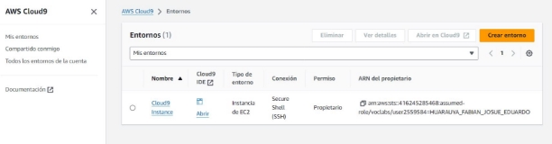
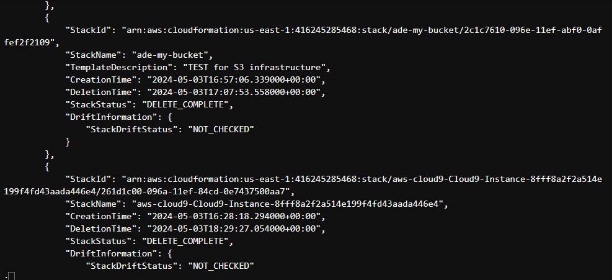
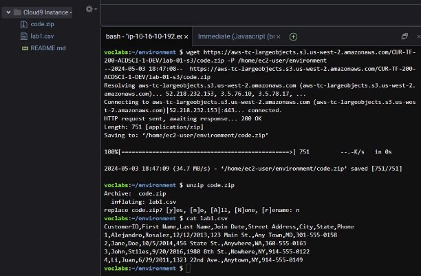
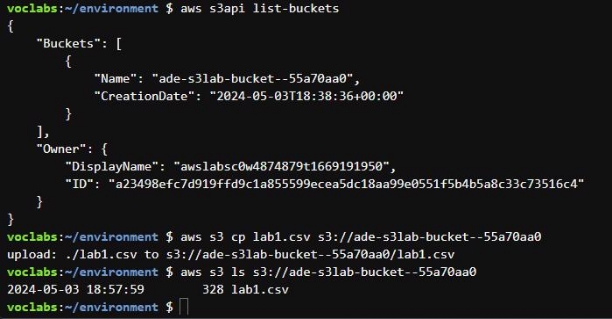
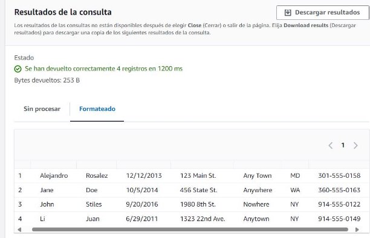
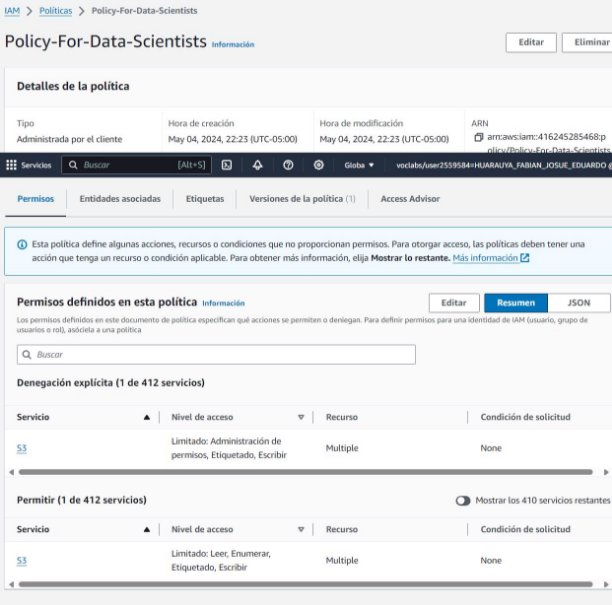
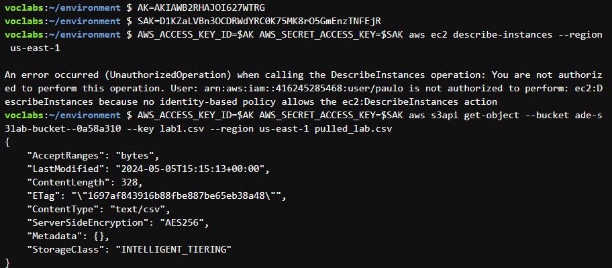

**Departamento Académico de Ingeniería C8286-Computación Paralela y Distribuida** 

**Evaluación: Módulos 2 y 3 AWS Data Engineering**

**Nombre:** Josue Eduardo Huarauya Fabian

- Identificar las principales características y funciones de Amazon S3 que permiten

  el acceso y análisis de datos.

- Describir cómo se utilizan los servicios de Amazon S3 para almacenar y

  recuperar grandes volúmenes de datos.

- Configurar un bucket de Amazon S3 para almacenar datos de manera eficiente.
- Comparar las ventajas de usar Amazon S3 frente a otras soluciones

  de almacenamiento de datos en términos de coste y rendimiento.

- Evaluar las implicaciones de seguridad y privacidad al utilizar Amazon S3

  en proyectos de análisis de datos

- Enumerar los cinco Vs de los datos: volumen, velocidad, variedad, veracidad y valor.
- Explicar cómo cada uno de los cinco Vs afecta la captura, el procesamiento y

  la visualización de datos.

- Utilizar un ejemplo práctico para demostrar cómo planificar y configurar una

  pipeline de datos considerando los cinco Vs

- Analizar cómo los diferentes tipos de variabilidad de los datos (velocidad, volumen, etc.) influyen en las decisiones tecnológicas para proyectos de big data.
- atos haya impactado negativamente en los resultados del análisis de datos.
- Desarrollar un plan estratégico para implementar una pipeline de datos efectiva

  que maneje adecuadamente los cinco Vs y maximice el valor de los datos para una

  organización específica.

**Instrucciones de entrega:**

- Crea un documento en markdown que incluya una breve explicación de las partes que creas más importantes de tus respuestas junto con las capturas de pantalla o texto correspondiente del laboratorio: Lab: Accessing and Analyzing Data by Using Amazon S3
- Para el módulo 3 presenta la verificación del Knowledge Check
- Subir el documento final a tu repositorio personal hasta el día 5 de mayo (23:59).

**MÓDULO 2**

Tarea 1

Navego hasta mi entorno de desarrollo integrado (IDE) en AWS Cloud9.

Creo una nueva plantilla de CloudFormation.

Para validar mi plantilla de CloudFormation, ejecuto el siguiente comando en una pestaña de terminal en mi IDE de AWS Cloud9.

Para crear mi pila, ejecuto el siguiente comando.

Los resultados incluyen un nombre de recurso de Amazon (ARN) de CloudFormation y son similares al siguiente. Esto indica que mi pila ha sido creada.

Para verificar que mi pila creó los recursos necesarios, ejecuto el siguiente comando. **aws s3api list-buckets**

el resultado es el siguiente**:**

Para eliminar mi pila, ejecuto el siguiente comando:

Confirmo que la pila y sus recursos han sido eliminados.

También puedo utilizar el siguiente comando en mi terminal AWS Cloud9 para confirmar que la pila se eliminó.

**aws cloudformation list-stacks**

El resultado proporciona información para varias pilas, pero la pila que creé tiene un StackStatus de DELETE\_COMPLETE. Las otras pilas se utilizaron para construir el entorno de mi laboratorio.

Para verificar que el depósito que creé la pila se eliminó, ejecuto el siguiente comando: **aws s3api list-buckets**

Tarea 2

Examinaré los datos en el conjunto de datos de muestra, que se proporcionó como un archivo .csv.

Para descargar el archivo, ejecuto el siguiente comando en mi terminal AWS Cloud9:

**wgethttps://aws-tc-largeobjects.s3.us-west-2.amazonaws.com/CUR-TF-200-ACDSCI-1-D EV/lab-01-s3/code.zip -P /home/ec2-user/environment**

El archivo code.zip se descarga en mi directorio local en AWS Cloud9. Para descomprimir el archivo, ejecuto el siguiente comando:

**unzip code.zip**

Cuando se me pregunte si quiero reemplazar code.zip, ingreso "n" y presiono Enter.

Nota: Al elegir no, mantengo el archivo .zip original y creo un archivo llamado lab1.csv en la carpeta actual.

Para ver el contenido del archivo lab1.csv, ejecuto el siguiente comando:

**cat lab1.csv**

Los siguientes son los contenidos del archivo:

CustomerID,First Name,Last Name,Join Date,Street Address,City,State,Phone 1,Alejandro,Rosalez,12/12/2013,123 Main St.,Any Town,MD,301-555-0158 2,Jane,Doe,10/5/2014,456 State St.,Anywhere,WA,360-555-0163 3,John,Stiles,9/20/2016,1980 8th St.,Nowhere,NY,914-555-0122 4,Li,Juan,6/29/2011,1323 22nd Ave.,Anytown,NY,914-555-0149

Observo que la primera fila del conjunto de datos contiene los nombres de las columnas.

Para copiar los datos en el depósito de S3:

Para recuperar el nombre del depósito de laboratorio, ejecuto el siguiente comando: **aws s3api list-buckets**

Tarea 3

Utilizaré S3 Select para ejecutar una consulta SQL sobre los datos cargados.

En la sección de consulta SQL, utilizaré la consulta existente, que es la siguiente:

Ahora ajustaré la consulta para ver solo los nombres de las tres primeras filas. En la sección de consulta SQL, cambiaré el texto de la consulta a lo siguiente:

Tarea 4

Modificaré la clase de almacenamiento del objeto almacenado en Amazon S3.

Tarea 5

Comprimi el archivo

Confirmo si puedo usar S3 Select para consultar el archivo comprimido.

Tarea 6 - Revisaré el grupo de IAM DataScienceGroup y la política de IAM adjunta al grupo.

Ahora, determinaré si puedo acceder a los datos en Amazon S3. Para probar mi acceso, emitiré comandos de AWS CLI utilizando mis credenciales. Primero, debo recuperar mi ID de clave de acceso y mi clave de acceso secreta, junto con la región de AWS de mi cuenta de laboratorio.

**MÓDULO 3**

Computación Paralela y Distribuida
